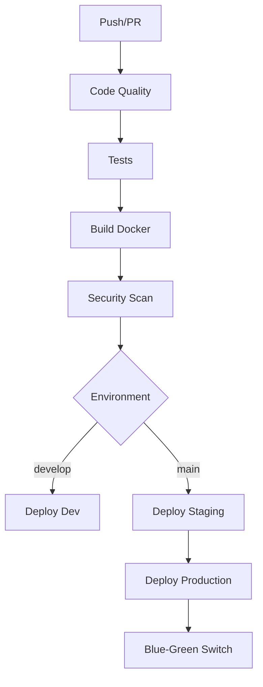

# Pipeline CI/CD VOD Platform - Documentación Demo

## Propósito de esta Demostración

Este repositorio contiene un pipeline completo de CI/CD diseñado para demostrar las mejores prácticas en DevOps para una plataforma de Video On Demand (VOD) desplegada en Kubernetes.

## Arquitectura del Pipeline

### Flujo Principal


## Componentes del Pipeline

### 1. **Code Quality & Linting**
- **ESLint** para JavaScript/TypeScript
- **Prettier** para formato de código
- **Black/Flake8** para Python
- **SonarQube** para análisis estático
- **MyPy** para type checking

### 2. **Testing Strategy**
- **Tests Unitarios** con coverage
- **Tests de Integración** con servicios reales (PostgreSQL, Redis)
- **Tests E2E** en staging
- **Performance Tests** con K6

### 3. **Security Scanning**
- **Trivy** para vulnerabilidades en imágenes Docker
- **ECR Image Scanning** integrado con AWS
- **Checkov** para infraestructura como código

### 4. **Build & Registry**
- **Docker Multi-arch** (AMD64, ARM64)
- **Amazon ECR** como registry
- **Build cache** optimizado con GitHub Actions
- **Semantic tagging** basado en Git

### 5. **Deployment Strategy**

#### Environments:
- **Development** (`develop` branch) - 1 replica, recursos mínimos
- **Staging** (`main` branch) - 3 replicas, tests completos
- **Production** - Blue-Green deployment, 10 replicas

#### Blue-Green Deployment:
```yaml
Production Strategy:
  ✅ Deploy nueva versión (Green)
  ✅ Warm-up y smoke tests
  ✅ Switch tráfico gradual
  ✅ Verificación post-deployment
  ✅ Cleanup versión anterior
```

## Configuración Requerida

### GitHub Secrets:
```bash
# AWS Credentials
AWS_ACCESS_KEY_ID
AWS_SECRET_ACCESS_KEY
AWS_ACCESS_KEY_ID_PROD
AWS_SECRET_ACCESS_KEY_PROD

# SonarQube
SONAR_TOKEN
SONAR_HOST_URL

# Testing & Monitoring
STAGING_URL
TEST_API_KEY
PROD_API_KEY
K6_CLOUD_TOKEN

# Notifications
SLACK_WEBHOOK_URL
MONITORING_WEBHOOK_URL

# Kubernetes
KUBE_CONFIG_DATA
```

### GitHub Environments:
- `development` (auto-deploy from develop)
- `staging` (auto-deploy from main)
- `production` (requires approval)

## Cómo Usar Este Demo

### 1. **Trigger Automático:**
```bash
# Deploy a Development
git push origin develop

# Deploy a Staging y Production
git push origin main
```

### 2. **Deployment Manual:**
- Ve a GitHub Actions
- Selecciona "VOD Platform CI/CD Pipeline"
- Clickea "Run workflow"
- Selecciona environment y action (plan/apply/destroy)

### 3. **Monitoreo:**
- Logs en GitHub Actions
- Notificaciones en Slack
- Métricas en sistemas de monitoreo

## Características Destacadas

### **Best Practices Implementadas:**
- **Reusabilidad** - Jobs modulares y reutilizables
- **Seguridad** - Múltiples layers de scanning
- **Granularidad** - Control fino por environment
- **Observabilidad** - Logs, métricas y notificaciones
- **Rollback** - Estrategia Blue-Green para rollback rápido
- **Testing** - Cobertura completa desde unit hasta E2E

### **Production Ready Features:**
- **Secrets Management** - GitHub Secrets + AWS
- **Multi-Environment** - Dev, Staging, Production
- **Container Registry** - ECR con multi-arch
- **Kubernetes Native** - Helm charts y manifests
- **Zero Downtime** - Blue-Green deployments
- **Scalability** - Auto-scaling configurado

## Recursos Educativos

### Conceptos Demostrados:
1. **GitOps Workflow** - Infrastructure as Code
2. **Security Shift-Left** - Security desde el desarrollo
3. **Progressive Delivery** - Deployments graduales
4. **Observability** - Logging, monitoring, alerting
5. **Disaster Recovery** - Rollback strategies

### Tecnologías Utilizadas:
- **GitHub Actions** - CI/CD Platform
- **Docker** - Containerización
- **Kubernetes** - Orquestación
- **Helm** - Package Manager
- **AWS EKS** - Managed Kubernetes
- **ECR** - Container Registry
- **Terraform** - Infrastructure as Code

## Valor Educativo

Este pipeline demuestra:
- **Integración completa** de herramientas DevOps
- **Escalabilidad** de micro a macro servicios
- **Seguridad** en cada etapa del pipeline
- **Automatización** de procesos manuales
- **Monitoring** y observabilidad
- **Best practices** de la industria

---

> **Nota:** Este es un proyecto de demostración. En un entorno real, requerirías infraestructura AWS real, configuración de Kubernetes, y ajustes específicos para tu organización.
