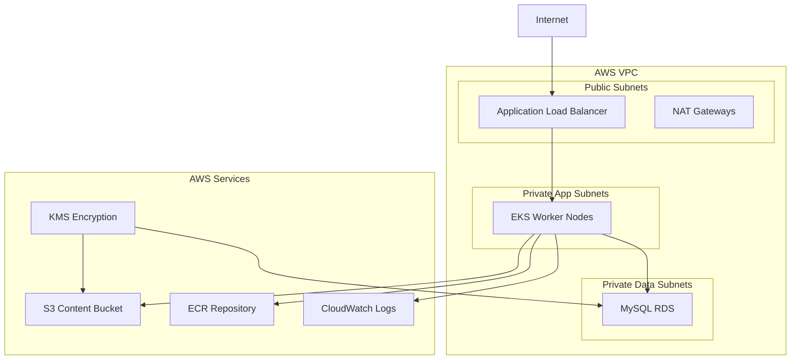

# Terraform Infrastructure - VOD Platform

Este directorio contiene la infraestructura como código (IaC) para la plataforma de Video On Demand, diseñada para desplegar en AWS usando mejores prácticas de seguridad, escalabilidad y mantenibilidad.

## Tabla de Contenidos

- [Arquitectura](#arquitectura)
- [Estructura del Proyecto](#estructura-del-proyecto)
- [Requisitos Previos](#requisitos-previos)
- [Configuración Inicial](#configuración-inicial)
- [Uso](#uso)
- [Ambientes](#ambientes)
- [Componentes](#componentes)
- [Seguridad](#seguridad)
- [Monitoreo](#monitoreo)
- [Costos](#costos)
- [Troubleshooting](#troubleshooting)

## Arquitectura

La infraestructura despliega una plataforma VOD completa con:

- **VPC Multi-AZ** con subredes públicas, privadas de aplicación y privadas de datos
- **EKS Cluster** con múltiples node groups optimizados por workload
- **RDS MySQL** con cifrado, backup automático y Multi-AZ en producción
- **S3** para almacenamiento de contenido con lifecycle policies
- **ECR** para imágenes Docker con scanning de vulnerabilidades
- **KMS** para cifrado en reposo de todos los datos sensibles
- **CloudWatch** para logging y monitoreo integral



## 📁 Estructura del Proyecto

### Archivos Refactorizados (Recomendado)
```
terraform/
├── README.md                    # Este archivo
├── main-refactored.tf          # Archivo principal simplificado
├── providers.tf                # Configuración de Terraform y proveedores
├── variables.tf                # Variables y configuración local
├── outputs.tf                  # Outputs para referencias externas
├── vpc.tf                      # Red y conectividad
├── security.tf                 # Security Groups
├── kms.tf                      # Cifrado y secrets management
├── eks.tf                      # Cluster Kubernetes
├── rds.tf                      # Base de datos
├── storage.tf                  # S3 y ECR
├── monitoring.tf               # CloudWatch y logging
├── environments/               # Configuraciones por ambiente
│   ├── development.tfvars
│   ├── staging.tfvars
│   └── production.tfvars
└── templates/                  # Templates dinámicos
    └── user_data.sh           # Script de inicialización EKS
```

### Archivo Original (Backup)
```
terraform/
└── main.tf                     # Archivo original de 1040 líneas (funcional)
```

## Requisitos Previos

### Herramientas Necesarias
- **Terraform** `>= 1.5`
- **AWS CLI** `>= 2.0` configurado
- **kubectl** `>= 1.28`
- **ssh-keygen** para generar llaves SSH

### Permisos AWS Requeridos
El usuario/rol de AWS debe tener permisos para:
- VPC, Subnets, Internet Gateways, NAT Gateways
- EKS Clusters y Node Groups
- RDS Instances y Subnet Groups
- S3 Buckets y políticas
- ECR Repositories
- KMS Keys y aliases
- IAM Roles y políticas
- CloudWatch Log Groups
- Secrets Manager

### Configuración de Cuenta AWS
```bash
# Configurar AWS CLI
aws configure

# Verificar acceso
aws sts get-caller-identity
```

## Configuración Inicial

### 1. Generar Llaves SSH
```bash
# Generar llave SSH para acceso a nodos EKS
ssh-keygen -t rsa -b 4096 -f ~/.ssh/vod-platform-key
```

### 2. Configurar Backend S3 (Opcional pero Recomendado)
```bash
# Crear bucket para Terraform state
aws s3 mb s3://vod-terraform-state-$(date +%s)

# Crear tabla DynamoDB para locking
aws dynamodb create-table \
  --table-name terraform-state-locks \
  --attribute-definitions AttributeName=LockID,AttributeType=S \
  --key-schema AttributeName=LockID,KeyType=HASH \
  --provisioned-throughput ReadCapacityUnits=5,WriteCapacityUnits=5
```

### 3. Actualizar Backend Configuration
Editar `providers.tf` con el nombre de tu bucket:
```hcl
backend "s3" {
  bucket = "tu-bucket-terraform-state"  # Cambiar aquí
  # ... resto de la configuración
}
```

## Uso

### Uso con Archivos Refactorizados (Recomendado)

#### Inicialización
```bash
cd terraform
terraform init
```

#### Planificación por Ambiente
```bash
# Development
terraform plan -var-file="environments/development.tfvars"

# Staging  
terraform plan -var-file="environments/staging.tfvars"

# Production
terraform plan -var-file="environments/production.tfvars"
```

#### Aplicación
```bash
# Development
terraform apply -var-file="environments/development.tfvars"

# Production (con confirmación)
terraform apply -var-file="environments/production.tfvars"
```

#### Destrucción
```bash
terraform destroy -var-file="environments/production.tfvars"
```

### Uso con Archivo Original
```bash
# Usando el main.tf original
terraform init
terraform plan -var environment=production
terraform apply -var environment=production
```

## 🌍 Ambientes

### Development
- **Propósito**: Desarrollo y testing inicial
- **Recursos**: Mínimos, t3.medium instances
- **Costo**: ~$200-300/mes
- **Características**:
  - 1-2 nodos EKS
  - RDS t3.micro
  - Sin Multi-AZ
  - Logs retención 7 días

### Staging
- **Propósito**: Testing pre-producción
- **Recursos**: Medios, similares a producción pero menores
- **Costo**: ~$500-800/mes
- **Características**:
  - 2-3 nodos EKS general + compute
  - RDS t3.small
  - Sin Multi-AZ
  - Logs retención 30 días

### Production
- **Propósito**: Ambiente de producción
- **Recursos**: Completos, optimizados para performance
- **Costo**: ~$1500-3000/mes
- **Características**:
  - 5+ nodos EKS multi-type (general/compute/gpu)
  - RDS r6g.large Multi-AZ
  - Backup 7 días
  - Logs retención 365 días
  - Deletion protection habilitado

## Componentes

### VPC y Networking
- **VPC**: `/16` CIDR con 3 AZs
- **Subredes Públicas**: Load balancers y NAT Gateways
- **Subredes Privadas App**: Workloads de aplicación
- **Subredes Privadas Data**: Bases de datos aisladas
- **NAT Gateways**: Uno por AZ para alta disponibilidad

### EKS Cluster
- **Control Plane**: Managed por AWS
- **Node Groups**: 
  - `general`: Workloads generales
  - `compute`: CPU-intensive tasks
  - `gpu`: Machine learning (solo producción)
- **Networking**: CNI plugin para networking avanzado
- **Logging**: Control plane logs en CloudWatch

### Base de Datos
- **Motor**: MySQL 8.0
- **Cifrado**: KMS en reposo y en tránsito
- **Backup**: Automático con retención configurable
- **Multi-AZ**: Solo en producción
- **Monitoring**: Enhanced monitoring habilitado

### Almacenamiento
- **S3**: Contenido de video con lifecycle policies
- **ECR**: Imágenes Docker con vulnerability scanning
- **EBS**: Volúmenes para nodos EKS (gp3, cifrados)

### Seguridad
- **KMS**: Llaves de cifrado para todos los servicios
- **Security Groups**: Principio de menor privilegio
- **IAM**: Roles específicos por servicio
- **Secrets Manager**: Credenciales con rotación automática

## Seguridad

### Cifrado
- **En Reposo**: KMS para RDS, S3, EBS, ECR
- **En Tránsito**: TLS 1.2+ para toda comunicación
- **Secretos**: AWS Secrets Manager con rotación

### Acceso
- **SSH**: Solo desde bastion hosts o IPs específicas
- **API**: EKS API server con acceso privado en producción
- **Database**: Solo desde nodos EKS, sin acceso público

### Monitoreo
- **CloudTrail**: Audit trail de todas las acciones
- **VPC Flow Logs**: Monitoreo de tráfico de red
- **GuardDuty**: Detección de amenazas (configurar por separado)

### Compliance
- **Encryption**: Cumple requisitos de cifrado
- **Access Control**: IAM con principio de menor privilegio
- **Audit**: Logs centralizados en CloudWatch

## Monitoreo

### Logs Centralizados
- **EKS Control Plane**: API, audit, authenticator logs
- **Applications**: Container logs por aplicación
- **System**: Node-level logs y métricas

### Métricas
- **Cluster**: CPU, memoria, network de nodos
- **Applications**: Custom metrics por aplicación  
- **Database**: RDS performance insights
- **Storage**: S3 y EBS metrics

### Alertas (Configurar Adicionalmente)
- **Resource Utilization**: CPU/Memory > 80%
- **Error Rates**: Application error spikes
- **Database**: Connection count, slow queries
- **Security**: Failed authentication attempts

## Costos

### Estimación Mensual por Ambiente

| Componente | Development | Staging | Production |
|------------|-------------|---------|------------|
| EKS Control Plane | $72 | $72 | $144 |
| EC2 Instances | $60-120 | $200-400 | $800-1500 |
| RDS | $15-30 | $50-100 | $300-600 |
| NAT Gateways | $32 | $32 | $96 |
| S3 Storage | $10-20 | $30-50 | $100-200 |
| Data Transfer | $10-20 | $30-50 | $100-300 |
| **Total Estimado** | **$200-300** | **$400-700** | **$1500-2800** |

### Optimización de Costos
- **Spot Instances**: Para dev/staging node groups
- **Reserved Instances**: Para workloads predictibles en producción
- **S3 Lifecycle**: Transición automática a storage classes más baratos
- **Right Sizing**: Monitoring para ajustar tamaños de instancia

## Troubleshooting

### Errores Comunes

#### Error: Backend Configuration
```bash
Error: Backend configuration changed
```
**Solución**: `terraform init -reconfigure`

#### Error: SSH Key Not Found
```bash
Error: file: no such file or directory
```
**Solución**: Generar llave SSH en `~/.ssh/id_rsa.pub`

#### Error: Insufficient Permissions
```bash
Error: AccessDenied
```
**Solución**: Verificar permisos IAM del usuario/rol

#### Error: Cluster Unreachable
```bash
Error: Kubernetes cluster unreachable
```
**Solución**: 
```bash
aws eks update-kubeconfig --region us-east-1 --name vod-platform-production
```

### Comandos Útiles

#### Verificar Estado
```bash
# Ver recursos creados
terraform state list

# Inspeccionar recurso específico
terraform state show aws_eks_cluster.main

# Verificar outputs
terraform output
```

#### Conectar a EKS
```bash
# Configurar kubectl
aws eks update-kubeconfig --region us-east-1 --name vod-platform-production

# Verificar nodos
kubectl get nodes

# Ver pods
kubectl get pods --all-namespaces
```

#### Logs y Debugging
```bash
# Logs de Terraform con debug
TF_LOG=DEBUG terraform apply

# Logs de EKS cluster
aws logs describe-log-groups --log-group-name-prefix "/aws/eks/"
```

## 📚 Referencias y Mejores Prácticas

### Documentación
- [Terraform AWS Provider](https://registry.terraform.io/providers/hashicorp/aws/latest/docs)
- [EKS Best Practices](https://aws.github.io/aws-eks-best-practices/)
- [AWS Well-Architected Framework](https://aws.amazon.com/architecture/well-architected/)

### Próximos Pasos
1. **GitOps**: Implementar ArgoCD para deployment de aplicaciones
2. **Service Mesh**: Considerar Istio para microservicios complejos
3. **Observability**: Implementar Prometheus + Grafana
4. **Security**: Integrar Falco para runtime security
5. **Backup**: Implementar Velero para backup de Kubernetes

### Contribuciones
Para mejoras o issues, crear pull request con:
- Descripción clara del cambio
- Testing en ambiente de desarrollo
- Documentación actualizada
- Consideraciones de seguridad

---

**Nota**: Este README cubre la infraestructura base. Para deployment de aplicaciones, referirse a los Helm charts en el directorio `/helm/`.
